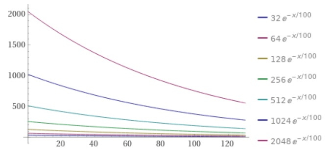
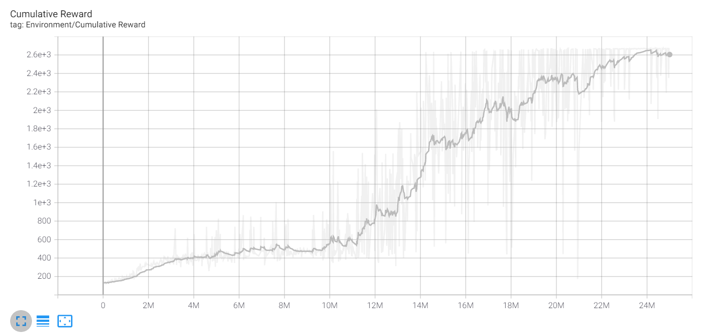
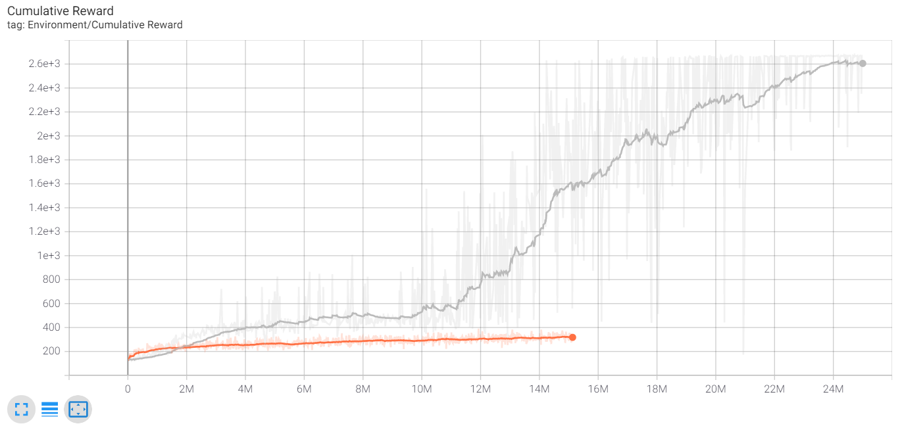
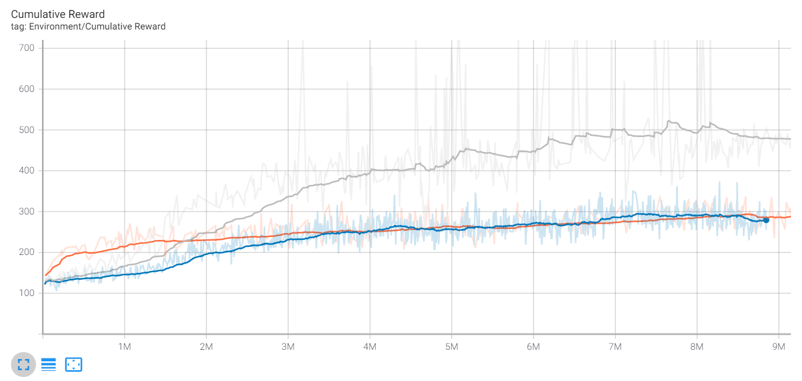
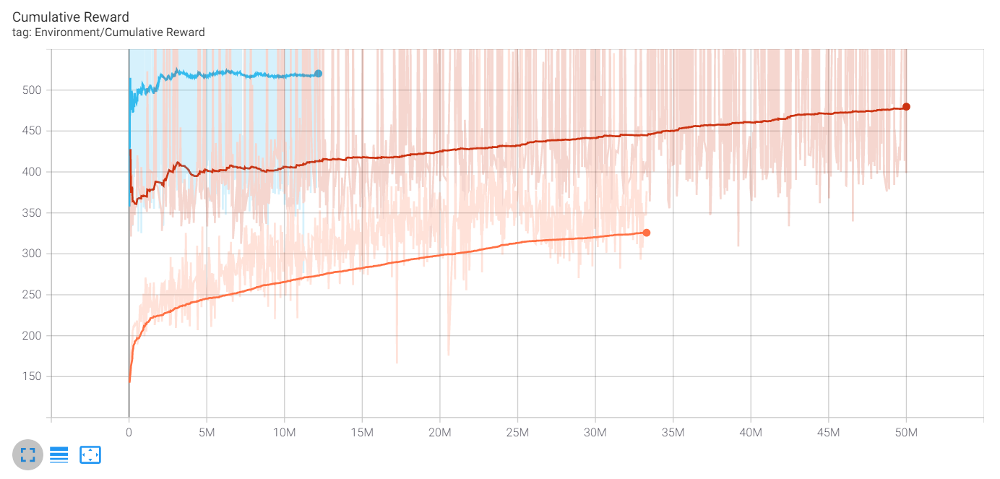

<details open="closed">
  <summary>Table of Contents</summary>
  <ol>
    <li>
      <a href="#about-the-project">About The Project</a>
    </li>
    <li>
      <a href="#agent-design">Agent Design</a>
      <ul>
        <li><a href="#observation">Observation</a></li>
        <li><a href="#actions">Actions</a></li>
        <li><a href="#reward-function">Reward Function</a></li>
        <li><a href="#training">Training</a></li>
      </ul>
    </li>
    <li><a href="#agent-for-simplified-2048">Agent for Simplified 2048</a></li>
    <li><a href="#agent-for-2048">Agent for 2048</a></li>
    <li><a href="#getting-started">Getting Started</a></li>
    <li><a href="#resources">Resources</a></li>
    <li><a href="#contact-and-license">Contact & License</a></li>
  </ol>
</details>

## About The Project

https://user-images.githubusercontent.com/8249946/129461000-7ee95073-adc7-4552-99dd-881ba665d0d6.mp4

If you never played it before, 2048 is a puzzle game. Tiles with values of 2 or 4 spawn randomly on a 4 by 4 grid. On each turn, you choose to shift all of the tiles up, down, left or right. Tiles with the same value combine into one tile with sum of the original tiles. Tiles "4" and "4" will combine to create "8". Tiles "8" and "8" will combine to create "16". The goal of the game is to create a tile with value of 2048. You can try to play it yourself at: https://play2048.co/

In this project we will use reinforcement learning to train an AI that can play and win a round of 2048.  

## Agent Design 

### Observation

The game grid is represented as an array of 16 numbers. Each element is 0 if the cell is empty or log base-2 of the tile value times 1/11 otherwise. The core idea is to evenly space out all of the tile values between 0 and 1.

I did consider using one hot encoding. That would lead to a 16*12 input space, and most of the observation would be zero most of the time. Therefore, I did not try it. But it could be something to experiment with.

### Actions 

The action space includes four actions: shift up, shift down, shift left and shift right. Therefore, the agent has a discrete, 4 dimensional output. Actions which do not change the state of the game are masked to prevent the agent from getting stuck.   

### Reward Function 

The are two reward functions used for experiments. 

The first function, used in most of the experiments, includes:
* penalty for actions which do not increase the score
* reward for every increase in total score
* reward for every new highest tile found (discounted, see graph below)
* reward for getting to 2048



The second function, also called Simple Reward, includes:
* reward for every new highest tile found

### Training

The agent is a 4 layer FFN trained with PPO. In general, I set a small beta (0.001) for entropy, and a large buffer (12,800) as the agent will need to do a lot of exploration. Also, gamma is large (0.995) for the discount to make sure the agent is looking many moves ahead. For specific hyperparameter settings please see YAML files in the config folder. 

## Agent for Simplified 2048

Dynamics of the game are tricky. Tiles spawn in random locations and with random values. This makes it harder for the agent to learn a good combination of moves. Also, the game gets exponential harder. It is a lot harder to get tile with value of 512 than a tile of 256. Lastly, certain moves do not change the state of the game. This can lead to an agent getting stuck.

For the initial proof-of-concept, I simplified the game by only spawning tiles with value 2 and in deterministic locations. Tile spawn settings can be changed by selecting a game, and changing the settings for "Manager (Script)" in Inspector window of Unity Editor. To handle the increasing difficulty, I designed a reward function to provide a reward for each time tiles are combined, each time a new high value tile is created, and for winning the game. There is also a penalty for each move which does not result in tiles combining. To prevent the agent from getting stuck, I mask each action which did not result in a change to the game gird in the previous move.

The agent for simplified 2048 is called deterLocDeterValwNormMask. Below is the command used to train it, the training curve and a video of a full game played by the agent. Note: before training be sure that you have uncommented the desired reward function in Agent2048.cs as well set the desired game configuration in Unity Editor. 

```sh
   mlagents-learn config/trainer.yaml --run-id=deterLocDeterValwNormMask
   ```



[](https://youtu.be/eQf2c7eh8LM)

## Agent for 2048

First let's observe that the original version of 2048 is much harder than the simplified version. We can see that from the training curves below. The agent managed to reach much higher average reward much faster on the simplified version.   

| Curve Color        | Description           | Run Id / Agent Name |
| ------------- |-------------| -----|
| Grey      | Agent training curve for simplified 2048 | deterLocDeterValwNormMask |
| Orange      | Fine tuning that agent on original 2048     |   rndLocRndValwNormMask |



### Complex Rewards 

The first question I had when advancing to the original version of 2048 was whether it is advantageous to start with the agent pre-trained on simplified 2048. It turns out that the pre-trained agent does perform better initially. However, after a while an agent trained from scratch (rndLocRndValwNormMaskColdStart) and a pre-trained agent (rndLocRndValwNormMask) have about the same training curve. They converge onto the same strategy. They both move highest value tiles to one side.

Below is the training command as well as the training curve for the cold start agent. Note: before training be sure that you have uncommented the desired reward function in Agent2048.cs as well set the desired game configuration in Unity Editor. 

```sh
   mlagents-learn config/trainer.yaml --run-id=rndLocRndValwNormMaskColdStart
   ```

| Curve Color        | Description           | Run Id / Agent Name |
| ------------- |-------------| -----|
| Blue | Training agent on original 2048 (cold start)     |    rndLocRndValwNormMaskColdStart |
| Orange      | Fine tuning on original 2048 (pre-trained)     |   rndLocRndValwNormMask |
| Grey      | Training on simplified 2048 | deterLocDeterValwNormMask |



Since the cold start and pre-trained agents eventually learned at the same rate, I decided to continue training the pre-trained agent. In total there were 3 runs of training. The commands and curves for these runs are below. These runs are called rndLocRndValwNormMask, rndLocRndValwNormMask_2, and rndLocRndValwNormMask_3. 

```sh
   mlagents-learn config/trainer.yaml --run-id=rndLocRndValwNormMask --initialize-from=deterLocDeterValwNormMask
   ```
```sh
   mlagents-learn config/trainer_2.yaml --run-id=rndLocRndValwNormMask_2 --initialize-from=rndLocRndValwNormMask
   ```
```sh
   mlagents-learn config/trainer_3.yaml --run-id=rndLocRndValwNormMask_3 --initialize-from=rndLocRndValwNormMask_2
   ```

| Curve Color        | Description           | Run Id / Agent Name |
| ------------- |-------------| -----|
| Orange      | First run  33M steps | rndLocRndValwNormMask |
| Red      | Second run 50M steps      |   rndLocRndValwNormMask_2 |
| Blue | Third run 12M steps      |    rndLocRndValwNormMask_3 |



After 215,000 games of 2048, the agent can win 4% (+/-3%) of rounds. See a winning game first row third column in the video below. 

[](https://youtu.be/3NAvX7lpD5Q)

### Simple Rewards 

It appears that the agent (rndLocRndValwNormMask_3) sometimes chooses to combine any tiles it can as oppose to work toward 2048. This leads to staircase like patterns which prevent the agent from reaching higher value tiles. These are probably the result of the reward for increasing the overall score of the game. For the following experiment, the reward function is simplified to just provide a reward each time a new value tile is formed. The first time the agent gets a tile of 16, it will get 16 reward, etc.

```sh
   mlagents-learn config/trainer_rndLocRndValNormwMaskSimpleReward.yaml --run-id=rndLocRndValNormwMaskSimpleReward
   ```

## Getting Started

To get started, first install Unity Game Engine from  https://unity.com/. This project also requires the ML Agents extension. Installation instructions can be found on the extension's Github, link below. 
* [Unity ML Agents](https://github.com/Unity-Technologies/ml-agents)

Once the Engine and ML Agents extension are installed, clone the project repository and import the project using Unity Hub. 

This project also uses the following assets, which are included in the project files. 
* [2048 Project in Unity Asset Store](https://assetstore.unity.com/packages/templates/packs/2048-23088)
* [Gridbox Prototype Materials](https://assetstore.unity.com/packages/2d/textures-materials/gridbox-prototype-materials-129127)

## Resources

### Unity ML Agents

* [Unity Agent Design](https://github.com/Unity-Technologies/ml-agents/blob/release_2_verified_docs/docs/Learning-Environment-Design-Agents.md#masking-discrete-actions)

* [Unity ML Agent Classes](https://docs.unity3d.com/Packages/com.unity.ml-agents@1.0/api/Unity.MLAgents.html)

* [Training Configuration File](https://github.com/Unity-Technologies/ml-agents/blob/main/docs/Training-Configuration-File.md#common-trainer-configurations)

### RL

* [Part 1: Key Concepts in RL](https://spinningup.openai.com/en/latest/spinningup/rl_intro.html#reward-and-return)

* [Part 3: Intro to Policy Optimization](https://spinningup.openai.com/en/latest/spinningup/rl_intro3.html#deriving-the-simplest-policy-gradient)

* [Understanding PPO Plots in TensorBoard](https://medium.com/aureliantactics/understanding-ppo-plots-in-tensorboard-cbc3199b9ba2)

### 2048

* [2048](https://play2048.co/)

* [Is every game of 2048 winnable? If not, what are the odds of any game being winnable, given perfect play?](https://www.quora.com/Is-every-game-of-2048-winnable-If-not-what-are-the-odds-of-any-game-being-winnable-given-perfect-play)

* [Is the game 2048 always solveable?](https://math.stackexchange.com/questions/720726/is-the-game-2048-always-solveable)

* [2048 Game Strategy - How to Always Win at 2048](https://www.gameskinny.com/lnagr/2048-game-strategy-how-to-always-win-at-2048)

## Contact and License

[@arturf124](https://twitter.com/arturf124) | [LinkedIn](https://www.linkedin.com/in/filipowicza/)

MIT License

